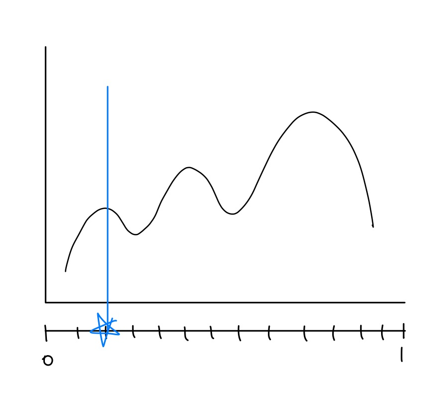
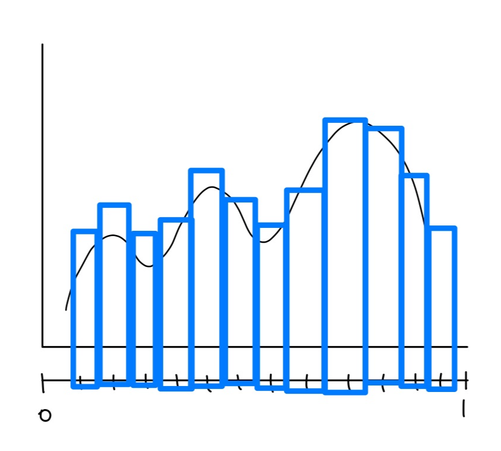

## Acceptance-Rejection Algorithm

이전에는 A-R 알고리즘을 "균등분포를 씌우고 곡선 안쪽 점은 accept, 바깥은 reject" 정도로만 두루뭉술하게 알고 있었다. 이 글에서는 그 디테일한 로직을 단계별로 정리한다.

## 셋업

지지구간 $[0,1]$ 위에 정의된 (그러나 직접 적분이 까다로운) 분포 $f(x)$ 에서 샘플을 뽑고 싶다.

![Target distribution f(x) on [0,1]](target.png)

## 알고리즘

### Step 1. x-축 샘플링

먼저 $x$-축에서 약 10,000개의 data point를 $\mathrm{Unif}(0,1)$ 에서 추출해 고정점으로 둔다.

### Step 2. y-축 샘플링

각 $x$ 고정점에 대해, $y$-축에서 약 10,000개의 data point를 $\mathrm{Unif}(0, a)$ 에서 추출한다. 여기서 $a$ 는 $f(x)$ 의 최댓값 (또는 그 이상). 즉, 곡선 $f(x)$ 를 충분히 덮는 가로 $1 \times$ 세로 $a$ 직사각형 안에 점들을 흩뿌리는 것.

### Step 3. Accept / Reject

각 $(x, y)$ 점에 대해

- $y \le f(x)$ → **accept** (곡선 안쪽 점)
- $y > f(x)$ → **reject** (곡선 바깥 점)

### Step 4. 모든 x에 대해 반복

위 과정을 모든 $x$-축 data point에 대해 반복한다. accept된 $(x, y)$ 점들의 **$x$-좌표만 모아서** 히스토그램으로 그리면 다음과 같다.

→ **원래 $f(x)$ 의 분포에 잘 근사**된다.

## 표본 통계량

이 accepted data point들의 $x$-좌표 평균을 구하면 $f(x)$ 의 표본 평균을 추정할 수 있다 (분산도 마찬가지).

## 왜 동작하나 (직관)

곡선 $f(x)$ 아래 면적은 정확히 1 (확률밀도이므로). 직사각형 $[0,1] \times [0,a]$ 에 균등하게 점을 뿌리면, **곡선 아래 영역에 떨어지는 비율**은 $\frac{1}{a}$. 그리고 이 영역 안의 점들은 **곡선 아래에서 균등 분포**를 따른다.

이때 $x$-좌표만 보면, 그 한계분포(marginal)가 정확히 $f(x)$ 가 된다.

수식으로:

$$P(X \le x \mid \text{accepted}) = \frac{\int_0^x f(t)\,dt}{\int_0^1 f(t)\,dt} = \int_0^x f(t)\,dt = F(x)$$

→ accepted $X$ 의 CDF가 $F$ 이므로 $X \sim f$. $\blacksquare$

## 일반화

지지구간이 $[0,1]$ 이 아니거나 $f$ 의 상한이 명확하지 않을 때는 임의의 proposal $g(x)$ 와 상수 $M$ 을 잡아 $f(x) \le M \cdot g(x)$ 를 만족시킨다. 그리고

1. $X \sim g$ 에서 후보를 뽑고,
2. $U \sim \mathrm{Unif}(0,1)$ 을 뽑아,
3. $U \le \dfrac{f(X)}{M \cdot g(X)}$ 이면 accept, 아니면 reject.

이때 accept된 $X$ 가 정확히 $f(x)$ 분포를 따른다. 위에서 다룬 케이스는 $g(x) = 1$ (균등 분포), $M = a$ 인 특수 경우에 해당한다.

---

> 원문: <https://chaeniverse.tistory.com/66>
