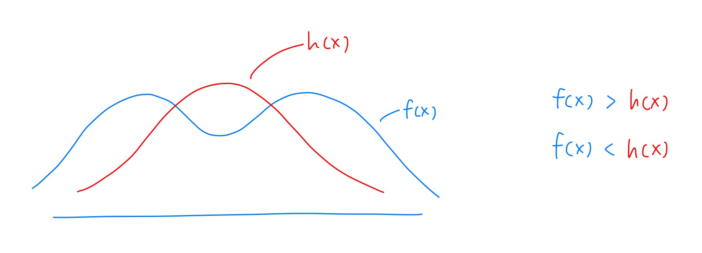
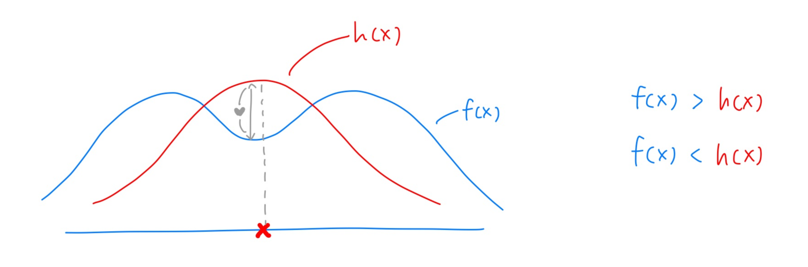
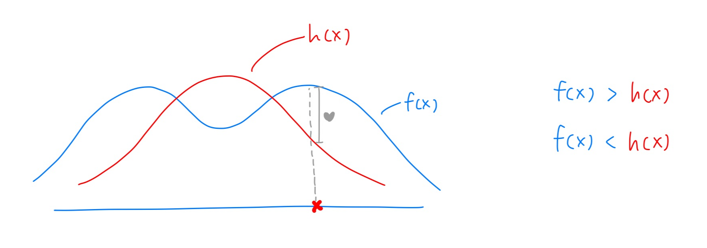
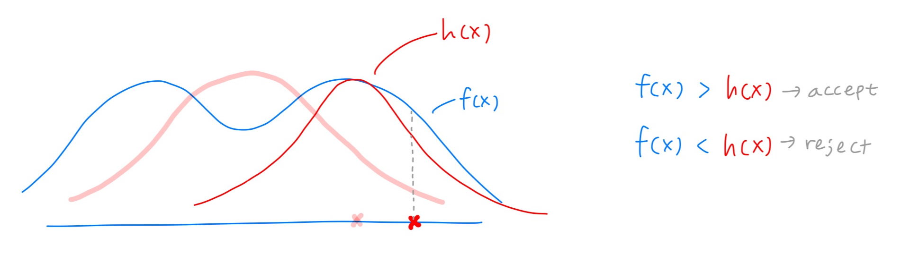
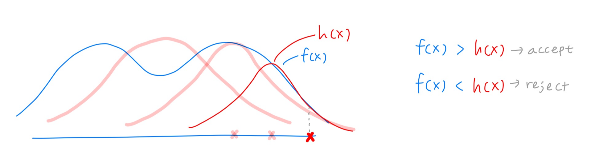
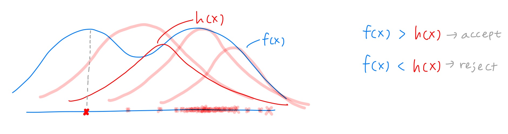
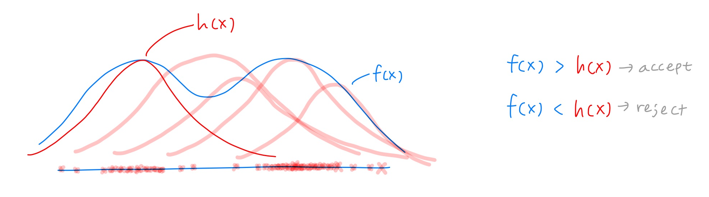
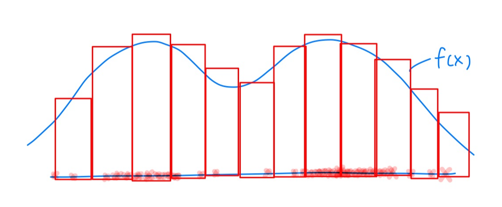

## Markov Chain Monte Carlo

간단히 말하면,

- **Markov chain** 은 그 전에 몇 번 시행했든 간에 **바로 이전 시행에 대해서만** 영향을 받는다는 거고,
- **Monte Carlo** 는 이상한 pdf의 분포를 구하기 어려울 때, 해당하는 pdf의 $x$ 를 많이 sampling해서 근사화시켜 표본 평균과 표본 분산을 구하는 과정을 말한다.

## 동기

가령, $f(x)$ 라는 분포의 기댓값, 분산을 알고 싶다고 하자.

이때 이 분포의 모양이 특이하면 (봉우리가 여러 개 있는 등), 적분하기 상당히 까다로울 것이다. 이럴 때 정규분포를 따르는 $h(x)$ 를 하나 씌워서 여기서 data point를 무작위로 뽑아 근사시켜 표본 평균·표본 분산을 구하는 식으로 기댓값과 분산을 유추할 수 있다.

위 그림에서 파란색이 우리가 알고 싶은 복잡한 분포 $f(x)$ (두 봉우리), 빨간색이 우리가 sampling에 쓸 proposal 분포 $h(x)$ (정규분포).

## 알고리즘 — Acceptance-Rejection 반복

### Step 1. Reject — 첫 시도가 실패하는 경우

정규분포를 따르는 $h(x)$ 에서 한 data point를 뽑았는데 우연히 이 위치가 뽑혔다고 가정하자.

이때 $f(x) < h(x)$ ("하트가 음수") 이면 해당 data point는 **reject** 하고, 같은 정규분포에서 data를 다시 추출한다.

### Step 2. Accept

새로 추출한 data point에서 $f(x) > h(x)$ 이므로 **accept**.

### Step 3. Proposal 이동

Accept하면 해당 data point를 중심으로 정규분포 $h(x)$ 를 다시 가정한다 (현재 위치로 proposal을 옮긴다).

### Step 4. 반복 — Random Walk

새로 가정한 정규분포에서 위와 같이 data point를 다시 무작위로 뽑는다.

그런데 $f(x) > h(x)$ 이면 해당 data를 accept하고 다시 그 지점으로 이동해 새 정규분포를 가정한다.

### Step 5. 다른 봉우리로 이동

이런 식으로 acceptance-rejection을 반복하면서 accept된 data point들을 차곡차곡 모아 놓는다. 그러다 보면, 처음에 있던 오른쪽 봉우리뿐 아니라 **왼쪽 봉우리에서도 data point가 추출**될 수 있다.

### Step 6. 양쪽 봉우리 모두 탐험

왼쪽 봉우리에서도 같은 acceptance-rejection을 반복한다.

## 결과

이런 식으로 알고리즘을 충분히 반복한 후 추출된 data point들의 히스토그램을 그리면 다음과 같은 모양을 띈다 — **원래 $f(x)$ 의 분포와 흡사**하다.

이 data point들의 평균을 구하면 $f(x)$ 의 표본 평균과 표본 분산을 얻을 수 있다.

---

## 보충: 정확한 Metropolis-Hastings 채택 확률

위 설명은 직관 중심이다. 실제 Metropolis-Hastings 알고리즘에서 **새 점 $x'$ 을 채택할 확률**은 다음과 같다.

$$\alpha(x' \mid x) \;=\; \min\!\left\{1,\; \frac{f(x')\, q(x \mid x')}{f(x)\, q(x' \mid x)}\right\}$$

여기서

- $f(\cdot)$ : 목표 분포 (target)
- $q(x' \mid x)$ : 현재 위치 $x$ 에서 다음 후보 $x'$ 을 제안하는 proposal density
- proposal이 대칭이면 ($q(x'\mid x) = q(x \mid x')$, 예: 평균이 현재 점에 있는 정규분포) **Metropolis** 알고리즘이 되어 비율이 $f(x')/f(x)$ 로 단순해진다.

즉, "$f$ 가 큰 곳으로 이동하면 무조건 accept, $f$ 가 작은 곳으로 이동하면 비율만큼의 확률로 accept". 위 직관 설명의 "f > h → accept, f < h → reject"는 이 채택 확률의 단순한 시각적 비유로 보면 된다.

---

> 원문: <https://chaeniverse.tistory.com/65>
