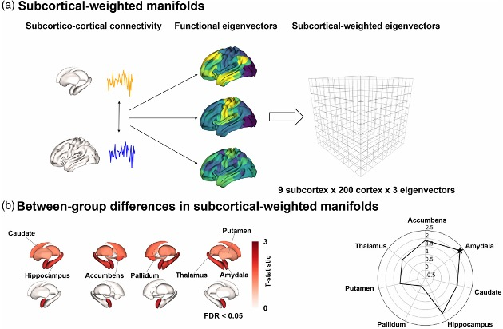
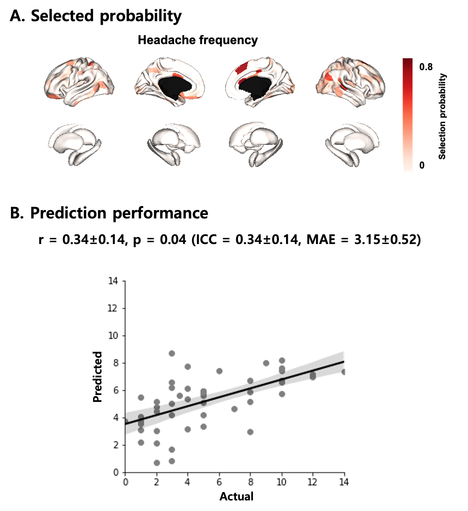

#### 개요

R과 Python을 활용해 편두통 환자군 데이터 분석을 수행하였습니다. 편두통 환자의 뇌 기능 저하를 정량적으로 평가하기 위한 모델을 구축하고 *Human Brain Mapping*에 1저자로 출판했습니다.

#### 방법론

**차원 축소.** 고차원의 뇌 영상 데이터를 비선형 매니폴드 러닝 기법으로 저차원으로 축소시켜 저차원 고유벡터를 생성했습니다. 결과에 영향을 미칠 수 있는 성별, 나이 등의 요소를 보정하여 다변량 분석을 수행했습니다.

**집단 간 비교.** 올바른 통계적 유의성 검정을 위해 false discovery rate (FDR) 보정을 거쳐 환자군과 정상군 사이에 영상 특징 데이터가 유의한 차이를 보이는 뇌 영역을 검출했습니다.

피질뿐만 아니라 피질-피질하 (subcortico-cortical) 연결성으로 가중된 매니폴드까지 확장해 피질하 영역에서도 환자군 특이적 차이를 검출했습니다.

**예측 모델링.** 편두통의 발병 횟수라는 임상학적 지표를 예측하기 위해 머신러닝 기법을 도입했습니다. 구체적으로, least absolute shrinkage and selection operator (LASSO)를 적용해 영상 피처들을 추출하고, 5-겹 중첩 교차 검증을 갖는 선형 회귀식으로 예측 모형을 구축했습니다. 내부 훈련 데이터 세트에서 성별과 나이를 보정한 후, intra class correlation (ICC)와 mean absolute error (MAE)를 기준으로 모델을 선출하고, 최종적으로 외부 검정 데이터 세트의 임상적 변수들을 예측했습니다. 피실험자들을 뽑는 과정에서 편향이 생기지 않도록 이 과정을 100회 반복했습니다. 예측 정확도는 실제 값과 예측 값 사이의 스피어만 상관 계수, ICC, MAE를 계산해 평가했고, 상관계수의 유의성은 비모수 순열 검정을 기반으로 결정했습니다.

#### 성과

본 연구를 통해 주어진 데이터를 명확하게 이해하고, 해당 데이터를 분석하기 위해 올바르고 견고한 통계 분석 기법을 적용하는 방법을 익혔습니다. 결과는 다음과 같이 출판되었습니다.

> C.H. Lee, H. Park, M.J. Lee, B. Park, "Whole-Brain Functional Gradients Reveal Cortical and Subcortical Alterations in Patients with Episodic Migraine," *Human Brain Mapping*, Apr. 2023.
