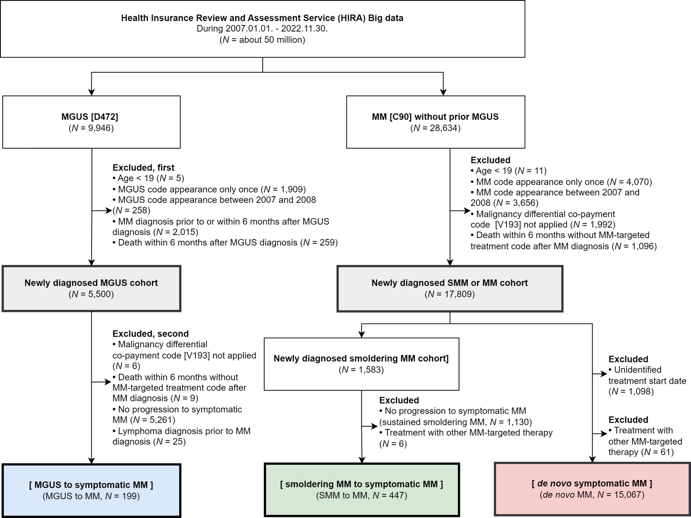

#### 개요

다발골수종(Multiple Myeloma, MM) 환자에서 전구 질환(MGUS, smoldering MM)의 사전 진단 여부에 따라 생존 확률이 어떻게 달라지는지 비교 분석한 전국 규모 후향적 코호트 연구입니다. 조기 검진(early detection)이 생존률을 높임을 입증해, MM 환자에 대한 초기 단계 screening의 임상적 가치를 제안했습니다.

#### 데이터

건강보험심사평가원(Health Insurance Review and Assessment Service, HIRA) 빅데이터 약 5천만 명 코호트에서 SQL을 활용해 MGUS, smoldering MM, *de novo* MM 환자군을 정의하고 추출했습니다.

#### 분석 방법

선택 편향을 보정하기 위해 inverse probability of treatment weighting (IPTW) 매칭을 적용하고, weighted survival curve와 marginal Cox proportional hazards 분석으로 그룹 간 생존 확률을 비교했습니다. 분석은 R과 SAS로 구현했습니다.

#### 성과

> S. Choi, S.S. Park, C.H. Lee, et al., "Improved Survival in Multiple Myeloma Following Prior Detection of Precursor Conditions: A Nationwide Real-world Study," *Blood Cancer Journal*, Oct. 2025.
