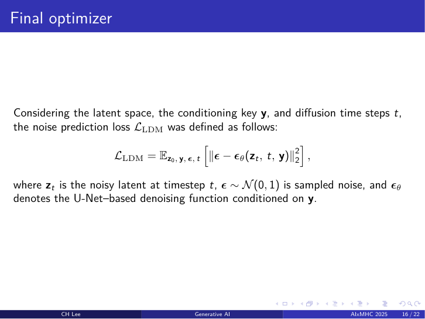

#### 개요

신생아 뇌 MRI에서 routinely 수집되는 T2-weighted (T2w) 영상으로부터 T1-weighted (T1w) 영상을 합성하는 cross-modality conversion 모델을 개발했습니다. T1w와 T2w는 조직 특성을 상보적으로 표현하지만, 신생아의 경우 짧은 스캔 시간, 움직임 인공물, 진정제 사용 위험 등으로 두 contrast 모두를 얻기 어렵습니다. 본 연구는 누락된 modality를 합성해 multi-contrast 진단을 가능케 하는 빠르고 sedation-free한 경로를 제시합니다.

#### 방법론

**모델 구조.** 2D slice-wise conditional latent diffusion model (LDM)을 설계했습니다. 40쌍의 bias field-corrected T1w/T2w 데이터를 z-축 기준으로 slicing하고, Autoencoder-KL로 latent 공간에 인코딩한 뒤, T2w latent와 modality 조건 정보를 spatially aligned 방식으로 결합해 conditional image-to-image translation을 수행했습니다.

**선행 기법과의 비교.** 기존 GAN 기반 cross-modality translation은 학습 과정의 특성상 mode collapse, 비수렴, 불안정성 문제가 빈번했습니다. Denoising Diffusion Probabilistic Model (DDPM) 계열은 noise-perturbation 학습 과정 덕분에 더 안정적이고 다양한 출력을 생성하며, 영상 합성 task에서 GAN보다 우수함이 보고되었습니다.

**손실 함수.** Latent space와 conditioning key $\mathbf{y}$, diffusion time step $t$ 를 함께 고려한 LDM의 noise prediction loss는 다음과 같이 정의됩니다.

#### 결과

Held-out test set에서 합성 T1w 영상이 다음 성능을 달성했습니다.

- **PSNR**: 21.03 dB
- **SSIM**: 0.6963

#### 의의

T2w만으로 누락된 T1w를 생성할 수 있어 multi-contrast neonatal MRI에 빠르고 sedation-free한 접근 경로를 제공합니다. 본 framework는 infant 또는 fetal MRI 데이터로도 자연스럽게 확장 가능합니다.

#### 성과

> C.H. Lee, K. Lee, B. Park, "Cross-Modality Neonatal Brain Image Conversion Using a Latent Diffusion Model," *2025 Second International Conference on Artificial Intelligence for Medicine, Health and Care (AIxMHC)*, IEEE, 2025. (Oral)
