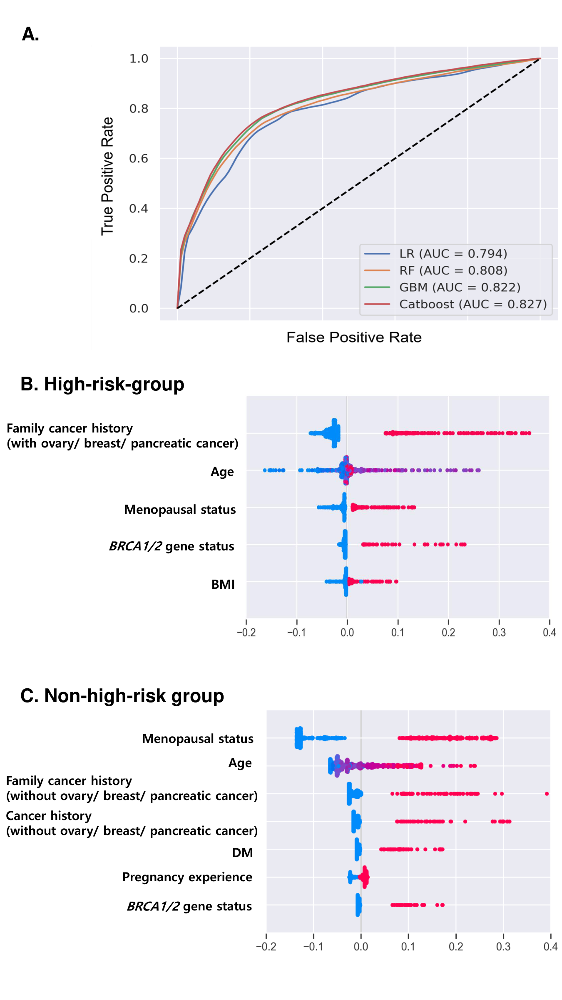
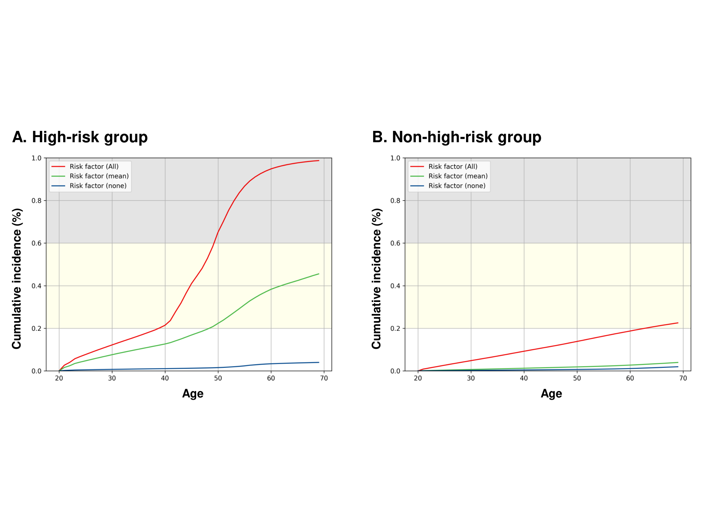

#### 개요

머신러닝을 활용하여 난소암 위험군을 분류하는 예측 시스템 개발 프로젝트입니다. EDA부터 데이터 전처리, 변수 선택, 모델링, 웹 앱 배포까지 전 과정을 수행했고, 논문은 현재 review 중입니다.

#### 데이터 전처리

**변수 탐색.** 범주형 변수는 2x2 table과 odds ratio로, 연속형 변수는 기초 통계량과 히스토그램으로 영향력을 점검했습니다. Odds ratio가 극단적인 변수는 sensitivity/specificity 분포를 왜곡할 수 있어 별도 검토했습니다.

**결측치 처리.** 결측률 40% 이상 변수는 설명력이 부족하다고 판단해 제거하고, 나머지는 연속형은 median, 범주형은 mode로 imputation 했습니다. Train set 통계량을 test set에도 동일 적용해 leakage를 방지했습니다.

**다중공선성 점검.** Imputation 후 VIF(variance inflation factor)를 산출해 cutoff 10 기준으로 변수를 한 번에 하나씩 제거하며 추이를 관찰했습니다.

**인코딩 및 스케일링.** 범주형 변수는 dummy encoding (reference 카테고리 제외)으로 변환했고, 연속형 변수는 Standardization 또는 MinMaxScaler를 적용했습니다. 표준화 통계량 역시 train 기준으로 test에 동일 적용했습니다.

#### 변수 선택

5-fold stratified cross-validation을 결합한 Recursive Feature Elimination (RFE-CV)로 변수를 선택했습니다. 평가 기준은 AUROC를 사용했고, RFE-CV 결과 그래프를 토대로 최종 5개 변수를 선정했습니다.

#### 모델링

**모델 비교.** Random Forest, Logistic Regression, XGBoost, CatBoost, MLP 5개 모델을 비교했습니다.

**평가 파이프라인.** 전체 데이터를 3:1 stratified split (train/test)으로 나누고, train 안에서 10-fold stratified cross-validation으로 하이퍼파라미터를 탐색했습니다. 효율을 위해 grid/random search 대신 **Bayesian optimization**을 사용했습니다. 각 fold의 train→val 전환 시 표준화 통계량은 train 기준으로 일관되게 적용했습니다.

**Robustness 확보.** 전체 split→tuning→fit→test 과정을 **50회 반복**하고 성능 metric의 평균을 최종 성능으로 보고했습니다. 이를 통해 subject selection bias를 줄이고 모델의 robustness를 높였습니다.

**클래스 불균형 처리.** 난소암 사례의 희소성을 고려해 undersampling을 적용하고, 그로 인해 편향된 예측 확률을 Bayes rule 기반 수식으로 보정했습니다.

**평가 지표.** Accuracy, Precision, Recall (Sensitivity), F1-score, AUC-ROC를 보고했습니다.

#### 배포

선정된 최종 모델을 **Python Shiny** 기반 웹 앱으로 배포해, 사용자 입력값에 대한 위험군 분류 결과와 lifetime risk cumulative incidence plot을 제공합니다.

> Live App: <https://chaehyun3253.shinyapps.io/my-app/>

#### 성과

논문 작성 완료, 현재 저널 review 중.
